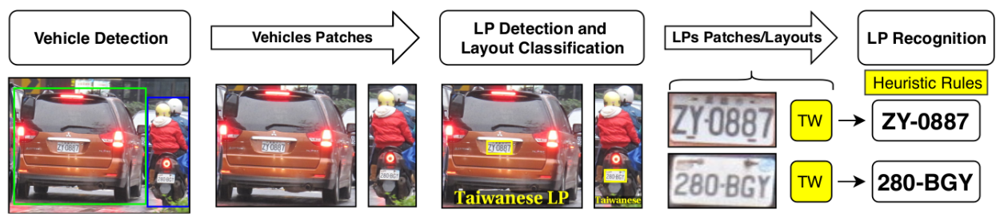
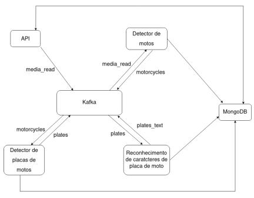
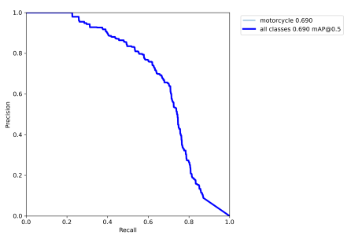
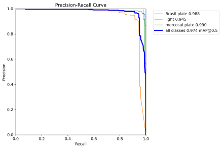

# Sistema assíncrono para reconhecimento automático de placas de motos

###### Aluno: Nalbert Gabriel Melo Leal

---

## Introdução

* O primeiro trabalho em reconhecimento automático de placas de veículo (ALPR) foi desenvolvido na década de 1990;
* Aplicação em diferentes atividades relacionadas ao controle de tráfego de veículos, aplicação de multas e controle de acesso de uma área;
* Permite uma melhora nas atividade dos serviços referentes ao fluxo de veículos;
* Captação de uma sequência de imagens (vídeo) que são enviadas a um detector responsável que realiza a detecção de placas e o reconhecimento dos caracteres.

---

## Introdução

<!-- * As áreas urbanas as cidades estão passando por um aumento populacional (ONU, 2019) que desencadeia problemas urbanos como pobreza, marginalização, consumo de recursos naturais e poluição (KOURTIT; NIJKAMP, 2013) -->
* Dentro das cidades inteligentes os sistemas relacionados ao controle de fluxo de veículos são importantes ferramentas que permitem o controle de veículos nos centros urbanos com sistemas como: estacionamentos inteligentes, radares de velocidade e câmeras de trânsito (LAROCA et al., 2018);
* Os sistemas ALPR podem ser utilizados para darem suporte a sistemas de cidades inteligentes para o controle do fluxo de veículos.

---

### Problema

A maior parte dos sistemas ALPR apresentados na literatura: 
* Não estão prontos para serem utilizados em ambientes reais;
* Não costumam realizar a detecção das placas de veículos de duas rodas;
* Não costumam dar suporte ao reconhecimento de mais de um modelo de placas de veículos;
* Realizam a detecção das placas de veículos em toda a imagem.

---

## Novo pipeline ALPR

Nos trabalhos ALPR mais recentes foi aplicado um novo pipeline no processamento de imagens que apresenta uma melhora no reconhecimento automático de placas veiculares.

Fonte: (LAROCA et al., 2018)

------

### Novo pipeline ALPR

------

### Novo pipeline ALPR

---

### Novo pipeline ALPR

---

### Novo pipeline ALPR

---

### Novo pipeline ALPR

---

## Objetivos Gerais

Desenvolver um sistema ALPR para o reconhecimento de placas de motos que implementa o novo pipeline na forma de um sistema distribuído com a comunicação assíncrona entre os serviços.

---

## Objetivos específicos

* Aplicar otimizações como int 8 nos modelos de reconhecimento de placas de motos;
* registrar ganhos e perdas na velocidade e acurácia do reconhecimento de placas;
* Otimizar o transporte dos dados entre os serviços de forma que a aceleração de hardware seja utilizada na compressão das mídias processadas;
* Cada componente do sistema deve receber, transmitir dados de forma assíncrona.

---

## Justificativa

Trabalhos de pesquisa em ALPR desenvolvidos pela PRF e pelo instituto metropole digital estão gerando novos resultados promisores e preenchendo lacunas na área. Assim, com o interesse de orgãos publicos (como a PRF) no desenvolvimento da área, esse trabalho tem potencial tanto no meio acadêmico quanto de uso por instituições que trabalham com o gerênciamento de tráfego de veiculos (como a PRF).

---

## Protótipo desenvolvido

* Quatro serviços que juntos implementam o pipeline apresentado;
* O kafka é o centralizador da comunicação entre os serviços;
* Armazenamento de dados com mongoDB.

___

## Sequência do pipeline no protótipo

Cada serviço é responsável por uma das redes neurais do pipeline recebendo e enviando os dados prodizidos atravêz do kafka.

---

<!-- ## Problemas do atual design

Como o deseign atual:
* Não foram aplicadas nem testadas otimizações mais agressivas como o int8 gerando uma menor performance no tempo de detecção e reconhecimento das imagens
* Não faz uso da aceleração de hardware para compresão e descompressão das mídias
* Não foram realizadas analises do sistema quando distribuido em mais de um computador
* O reconhecimento de caracteres é feito por uma rede neural treinada com placas de veiculos de quatro rodas

--- -->

<!-- --- -->

<!-- ## As reconhecimento de motos -->

<!-- (recal é o quanto de uma classe o modelo conseguiu identificar no teste e a precisão quantas resposta dadas pelo modelos como verdadeiras são realmente verdadeiras) -->

<!-- Este gráfico possui uma curva **recal X precisão**. Quanto mais próximo do canto superior direito a curva estiver melhor melhor.

---

## As reconhecimento de placas

--- -->

## Etapas do projeto

|   |
|---|
| Testar e analisar o design do sistema quando funcionando em mais de um computador |
| Revisão da arquitetura desenvolvida |
| Comparar diferentes formas de realizar o transporte das mídias entre os serviços e aplicar a mais eficiente |
| Desenvolver uma nova rede neural para reconhecimento de caracteres de motos |
| Revisão dos modelos desenvolvidos para aplicação de otimizações como int8 |

---

## Referências

<!-- ONU. ONU prevê que cidades abriguem 70% da população mundial até 2050. 2019. ONU News. Disponível em: https://news.un.org/pt/story/2019/02/1660701. Acesso em: 16 de outubro de 2022. -->

KOURTIT, K.; NIJKAMP, P. In praise of megacities in a global world. Regional
Science Policy & Practice, v. 5, n. 2, p. 167–182, 2013. Disponível em: https://rsaiconnect.onlinelibrary.wiley.com/doi/abs/10.1111/rsp3.12002

LAROCA, R. et al. A robust real-time automatic license plate recognition based on the YOLO detector. In: 2018 International Joint Conference on Neural Networks (IJCNN). IEEE, 2018. Disponível em: https://doi.org/10.1109%2Fijcnn.2018.8489629.

---

## Referências

LAROCA, R. et al. An efficient and layout-independent automatic license plate recognition system based on the YOLO detector. IET Intelligent Transport Systems, Institution of Engineering and Technology (IET), v. 15, n. 4, p. 483–503, feb 2021. Disponível em: https://doi.org/10.1049%2Fitr2.12030.

LEAL, Nalbert Gabriel Melo. Sistema assíncrono para reconhecimento automático de placas de motos. 2022. 75 f. Trabalho de Conclusão de Curso (Bacharelado em Engenharia de Software) — Departamento de Informática e Matemática Aplicada, Universidade Federal do Rio Grande do Norte. Natal, 2022. Disponível em: https://repositorio.ufrn.br/handle/123456789/50337